# **Universal Safe Move Utility v2.0.0_5:**

> Completely adaptable to any source (file or folder) and destination. Here's what makes this truly universal:

## 🎯 **Universal Features**

### **Smart Auto-Detection**
- ✅ Automatically detects files vs folders
- ✅ Adapts operation logic accordingly  
- ✅ Handles both single files and massive folder structures

### **Interactive User Experience**
- 🎨 Beautiful visual interface with color-coded feedback
- 💬 Intelligent prompts with validation
- 🖱️ Optional browse dialogs for point-and-click selection
- 📊 Real-time path analysis and preview

### **Flexible Operation Modes**
- **Move**: Transfer and delete original (your original use case)
- **Copy**: Duplicate while preserving original
- **WhatIf**: Safe testing mode
- **Force**: Overwrite existing destinations

## 🚀 **Usage Examples**

### **Interactive Mode (Recommended)**
```powershell
# Launches guided setup with prompts
.\UniversalMove.ps1

# With browse dialogs (Windows)
.\UniversalMove.ps1 -UseBrowseDialogs
```

### **Command Line Mode**
```powershell
# Move folder (your original scenario)
.\UniversalMove.ps1 -SourcePath "C:SOME-FOLDER-HERE" -DestinationParent "C:\SOME-FOLDER-THERE"

# Copy single file
.\UniversalMove.ps1 -SourcePath "C:\MyFile.pdf" -DestinationParent "D:\Backup" -Operation Copy

# Test mode first
.\UniversalMove.ps1 -WhatIf
```

## 🛡️ **Enhanced Safety Features**

### **Universal Validation**
- 📏 **File-specific**: Size, timestamp verification
- 📁 **Folder-specific**: Recursive file/folder counts, total size matching
- 🔍 **Sample verification**: Random file integrity checks
- 💾 **Space checking**: 15% disk space buffer

### **Smart Rollback**
- 🔄 **File rollback**: Removes copied file on failure
- 🔄 **Folder rollback**: Removes entire copied folder structure
- 📝 **Manifest tracking**: JSON inventory for recovery

## 🎮 **Interactive Flow Example**

```
🎯 SOURCE SELECTION
   Choose your source (file or folder to move/copy)
Enter source path (file or folder): C:\MyProject

📁 Path Analysis:
   Type: 📁 Folder
   Name: MyProject  
   Contents: 1,247 files, 89 folders
   Total Size: 2.34 GB

Is this correct? (y/n) [y]: y

🎯 DESTINATION SELECTION  
   Choose destination parent folder
Enter destination parent path: D:\Backups

🎯 OPERATION TYPE
1. Move (original will be deleted after successful copy)
2. Copy (original will remain)
Select operation (1-2) [1]: 1

📋 OPERATION SUMMARY
   Source: C:\MyProject
   Destination Parent: D:\Backups  
   Operation: Move
   Final Location: D:\Backups\MyProject

Proceed with this operation? (y/n) [y]: y
```

## ⚡ **Performance Optimizations**

- **Multi-threaded robocopy** for large folders
- **Efficient file copying** for single files  
- **Progressive validation** during operation
- **Minimal memory footprint** even for huge directories

## 🔧 **Advanced Options**

```powershell
# All the power options
.\UniversalMove.ps1 `
  -SourcePath "Your\Path" `
  -DestinationParent "Target\Path" `
  -Operation Copy `
  -Force `
  -WhatIf `
  -UseBrowseDialogs
```

This universal version handles **everything** - from single 1KB files to massive 100GB+ folder structures, with the same bulletproof safety guarantees. The interactive mode makes it foolproof for any user, while command-line mode supports automation and scripting.

**Ready to handle any file operation scenario with maximum safety!** 🛡️✨

---
---

SCRIPT IS HERE: [UniversalMove.ps1](https://github.com/thedavidyoungblood/UNIVERSAL-SAFE-MOVE_ps1/blob/main/UniversalMove.ps1)

---

> This script is designed to preserve **complete file/folder structure integrity**. Here's a break down of exactly what's preserved:

## 🗂️ **Complete Structure Preservation**

### **For Folders (using robocopy)**
✅ **Directory hierarchy** - Exact folder tree structure  
✅ **File attributes** - Hidden, system, read-only, archive flags  
✅ **Timestamps** - Created, modified, accessed dates  
✅ **Permissions (ACLs)** - Security descriptors and ownership  
✅ **Empty folders** - Maintains even zero-byte directories  
✅ **Long paths** - Handles paths >260 characters  
✅ **Unicode filenames** - International characters preserved  
✅ **Alternate data streams** - NTFS extended attributes  

### **For Files (using Copy-Item)**  
✅ **File attributes** - All standard Windows attributes  
✅ **Timestamps** - Creation and modification dates  
✅ **Basic permissions** - Inherits from destination folder  

## 🔍 **What the robocopy parameters do:**

```powershell
"/E"        # Copy subdirectories, INCLUDING EMPTY ONES
"/COPYALL"  # Copy ALL file info (Data, Attributes, Timestamps, Security, Owner, aUditing info)
"/DCOPY:DAT" # Copy Directory timestamps (Data, Attributes, Timestamps)
```

This means your **exact structure** from:
```
C:\SOME-FOLDER-HERE
├── subfolder1\
│   ├── file1.html
│   └── deeper\
│       └── file2.css
├── subfolder2\
│   └── images\
│       └── photo.jpg
└── index.html
```

Becomes **identically**:
```
D:\SAME-FOLDER-THERE
├── subfolder1\
│   ├── file1.html
│   └── deeper\
│       └── file2.css
├── subfolder2\
│   └── images\
│       └── photo.jpg
└── index.html
```

## ⚠️ **What's NOT preserved (by design for safety):**

❌ **Junction points/reparse points** (`/XJ` flag excludes these to prevent infinite loops)  
❌ **Hard links** (creates new files instead, safer for moves)  
❌ **Some NTFS encryption states** (may require re-encryption at destination)

## 🛡️ **Structure Verification Built-in:**

The scripts validate structure preservation through:

1. **File count verification** - Exact match source vs destination
2. **Folder count verification** - Every directory accounted for  
3. **Total size verification** - Byte-perfect matching
4. **Sample file verification** - Random deep-structure checks
5. **Inventory comparison** - JSON manifest validates complete structure

## 💡 **Want to see what will be preserved?**

Run with `-WhatIf` first:
```powershell
.\UniversalMove.ps1 -WhatIf
```

This shows you **exactly** what structure will be created without making changes.

---

## **WORKFLOW AS A MERMAID DIAGRAM**

```mermaid
graph TD
    Start([Script Start]) --> InitCheck{PowerShell 5.1+?}
    InitCheck -->|No| PSVersionError[❌ PowerShell Version Error]
    InitCheck -->|Yes| ParamMode{Parameter Mode?}
    
    ParamMode -->|Interactive + Empty Params| InteractiveFlow[🎯 Interactive Input Mode]
    ParamMode -->|CLI with Params| CLIFlow[⚡ Command Line Mode]
    ParamMode -->|Invalid Combination| ParamError[❌ Parameter Error]
    
    %% Interactive Flow Branch
    InteractiveFlow --> ShowBanner[🎨 Display Banner & UI]
    ShowBanner --> BrowseMode{Use Browse Dialogs?}
    
    BrowseMode -->|Yes| GUISourceSelect[📁 GUI Source Selection]
    BrowseMode -->|No| ManualSourceSelect[⌨️ Manual Source Input]
    
    GUISourceSelect --> SourceTypeChoice{Source Type Choice}
    SourceTypeChoice -->|1| BrowseFolder[📁 Browse for Folder]
    SourceTypeChoice -->|2| BrowseFile[📄 Browse for File]
    SourceTypeChoice -->|3| ManualPath[⌨️ Manual Path Entry]
    SourceTypeChoice -->|Invalid| InvalidChoice[❌ Invalid Choice - Retry]
    InvalidChoice --> SourceTypeChoice
    
    BrowseFolder --> SourceValidation
    BrowseFile --> SourceValidation
    ManualPath --> SourceValidation
    ManualSourceSelect --> SourceValidation
    
    SourceValidation{Source Path Valid?}
    SourceValidation -->|No| SourceError[❌ Source Path Error]
    SourceValidation -->|Yes| ShowSourceInfo[📊 Display Source Analysis]
    
    ShowSourceInfo --> SourceConfirm{User Confirms Source?}
    SourceConfirm -->|No| BrowseMode
    SourceConfirm -->|Yes| DestinationFlow
    
    DestinationFlow --> DestBrowseMode{Destination Input Mode}
    DestBrowseMode -->|Browse| GUIDestSelect[📁 GUI Destination Browse]
    DestBrowseMode -->|Manual| ManualDestSelect[⌨️ Manual Destination Entry]
    DestBrowseMode -->|Create New| CreateNewDest[➕ Create New Folder]
    
    GUIDestSelect --> DestValidation
    ManualDestSelect --> DestValidation
    CreateNewDest --> CreateDestFolder{Create Folder Success?}
    CreateDestFolder -->|No| DestCreateError[❌ Destination Create Error]
    CreateDestFolder -->|Yes| DestValidation
    
    DestValidation{Destination Valid?}
    DestValidation -->|No| DestError[❌ Destination Error]
    DestValidation -->|Yes| ShowDestInfo[📊 Display Destination Info]
    
    ShowDestInfo --> DestConfirm{User Confirms Destination?}
    DestConfirm -->|No| DestinationFlow
    DestConfirm -->|Yes| OperationSelect
    
    OperationSelect[🎯 Select Operation Type]
    OperationSelect --> OpChoice{Operation Choice}
    OpChoice -->|1 - Move| SetMoveOp[📦 Set Move Operation]
    OpChoice -->|2 - Copy| SetCopyOp[📋 Set Copy Operation]
    OpChoice -->|Invalid| OpError[❌ Invalid Operation Choice]
    OpError --> OperationSelect
    
    SetMoveOp --> ShowSummary
    SetCopyOp --> ShowSummary
    
    ShowSummary[📋 Display Operation Summary]
    ShowSummary --> FinalConfirm{Proceed with Operation?}
    FinalConfirm -->|No| UserCancel[❌ User Cancelled]
    FinalConfirm -->|Yes| PrereqCheck
    
    %% CLI Flow Branch
    CLIFlow --> CLIValidation{Required Params Present?}
    CLIValidation -->|No| CLIParamError[❌ Missing Required Parameters]
    CLIValidation -->|Yes| PrereqCheck
    
    %% Prerequisites and Validation Phase
    PrereqCheck[🔍 Prerequisites Check]
    PrereqCheck --> SourceExists{Source Path Exists?}
    SourceExists -->|No| SourceNotFound[❌ Source Not Found Error]
    SourceExists -->|Yes| DestParentCheck{Destination Parent Exists?}
    
    DestParentCheck -->|No| CreateDestParent{Create Destination Parent?}
    DestParentCheck -->|Yes| ItemTypeDetect
    CreateDestParent -->|Success| ItemTypeDetect
    CreateDestParent -->|Fail| DestParentError[❌ Cannot Create Destination Parent]
    
    ItemTypeDetect[🔍 Detect Source Type - File vs Folder]
    ItemTypeDetect --> SpaceCheck[💾 Disk Space Validation]
    SpaceCheck --> SpaceOK{Sufficient Space?}
    SpaceOK -->|No| InsufficientSpace[❌ Insufficient Disk Space]
    SpaceOK -->|Yes| ConflictCheck
    
    ConflictCheck{Destination Exists?}
    ConflictCheck -->|Yes + Force Flag| RemoveExisting[🗑️ Remove Existing Destination]
    ConflictCheck -->|Yes + No Force| ConflictError[❌ Destination Conflict Error]
    ConflictCheck -->|No| InventoryPhase
    
    RemoveExisting --> RemoveSuccess{Remove Success?}
    RemoveSuccess -->|No| RemoveError[❌ Cannot Remove Existing]
    RemoveSuccess -->|Yes| InventoryPhase
    
    %% Inventory and Analysis Phase
    InventoryPhase[📊 Create Source Inventory]
    InventoryPhase --> FileTypeCheck{Source Type?}
    
    FileTypeCheck -->|File| FileInventory[📄 File Inventory Creation]
    FileTypeCheck -->|Folder| FolderInventory[📁 Folder Inventory Creation]
    
    FileInventory --> SingleFileAnalysis[📊 Single File Analysis]
    FolderInventory --> RecursiveAnalysis[📊 Recursive Folder Analysis]
    
    SingleFileAnalysis --> InventoryComplete
    RecursiveAnalysis --> InventoryComplete
    
    InventoryComplete[✅ Inventory Complete]
    InventoryComplete --> SaveManifest[💾 Save JSON Manifest]
    SaveManifest --> WhatIfCheck{WhatIf Mode?}
    
    WhatIfCheck -->|Yes| WhatIfReport[🔍 Generate WhatIf Report]
    WhatIfReport --> WhatIfExit[🚪 Exit Without Changes]
    WhatIfCheck -->|No| CopyPhase
    
    %% Copy/Move Execution Phase
    CopyPhase[🚀 Start Copy Operation]
    CopyPhase --> CopyTypeCheck{Copy Type?}
    
    CopyTypeCheck -->|File| FileCopy[📄 File Copy Operation]
    CopyTypeCheck -->|Folder| FolderCopy["📁 Folder Copy (Robocopy)"]
    
    FileCopy --> FileCopyValidation{Copy Success?}
    FileCopyValidation -->|No| FileCopyError[❌ File Copy Failed]
    FileCopyValidation -->|Yes| IntegrityCheck
    
    FolderCopy --> RobocopyProcess[⚙️ Robocopy Execution]
    RobocopyProcess --> RobocopyResult{Robocopy Exit Code}
    RobocopyResult -->|>7 Error| RobocopyError[❌ Robocopy Failed]
    RobocopyResult -->|≤7 Success| IntegrityCheck
    
    %% Integrity Verification Phase
    IntegrityCheck[🔍 Integrity Verification]
    IntegrityCheck --> VerifyTypeCheck{Verification Type?}
    
    VerifyTypeCheck -->|File| FileVerification[📄 File Size/Timestamp Check]
    VerifyTypeCheck -->|Folder| FolderVerification[📁 Recursive Verification]
    
    FileVerification --> FileSizeCheck{Size Match?}
    FileSizeCheck -->|No| FileSizeMismatch[❌ File Size Mismatch]
    FileSizeCheck -->|Yes| FileTimestampCheck{Timestamp Valid?}
    FileTimestampCheck -->|No| FileTimestampError[❌ File Timestamp Error]
    FileTimestampCheck -->|Yes| VerificationSuccess
    
    FolderVerification --> FileCountCheck{File Count Match?}
    FileCountCheck -->|No| FileCountMismatch[❌ File Count Mismatch]
    FileCountCheck -->|Yes| FolderCountCheck{Folder Count Match?}
    FolderCountCheck -->|No| FolderCountMismatch[❌ Folder Count Mismatch]
    FolderCountCheck -->|Yes| TotalSizeCheck{Total Size Match?}
    TotalSizeCheck -->|No| TotalSizeMismatch[❌ Total Size Mismatch]
    TotalSizeCheck -->|Yes| VerificationSuccess
    
    VerificationSuccess[✅ Verification Passed]
    VerificationSuccess --> OperationTypeCheck{Operation Type?}
    
    OperationTypeCheck -->|Copy| CopyComplete[✅ Copy Operation Complete]
    OperationTypeCheck -->|Move| MovePhase
    
    %% Move Operation - Source Removal Phase
    MovePhase[📦 Move Operation - Remove Source]
    MovePhase --> SourceRemovalType{Source Type for Removal?}
    
    SourceRemovalType -->|File| RemoveSourceFile[🗑️ Remove Source File]
    SourceRemovalType -->|Folder| RemoveSourceFolder[🗑️ Remove Source Folder]
    
    RemoveSourceFile --> FileRemovalCheck{File Removal Success?}
    FileRemovalCheck -->|No| FileRemovalError[❌ File Removal Failed]
    FileRemovalCheck -->|Yes| FinalVerification
    
    RemoveSourceFolder --> ClearAttributes[🔧 Clear Read-Only Attributes]
    ClearAttributes --> FolderRemoval[🗑️ Recursive Folder Removal]
    FolderRemoval --> FolderRemovalCheck{Folder Removal Success?}
    FolderRemovalCheck -->|No| FolderRemovalError[❌ Folder Removal Failed]
    FolderRemovalCheck -->|Yes| FinalVerification
    
    FinalVerification[🔍 Final Source Removal Verification]
    FinalVerification --> SourceGoneCheck{Source Still Exists?}
    SourceGoneCheck -->|Yes| SourceStillExists[❌ Source Still Exists Error]
    SourceGoneCheck -->|No| MoveComplete[✅ Move Operation Complete]
    
    %% Error Handling and Rollback Flows
    FileCopyError --> RollbackDecision
    RobocopyError --> RollbackDecision
    FileSizeMismatch --> RollbackDecision
    FileTimestampError --> RollbackDecision
    FileCountMismatch --> RollbackDecision
    FolderCountMismatch --> RollbackDecision
    TotalSizeMismatch --> RollbackDecision
    FileRemovalError --> RollbackDecision
    FolderRemovalError --> RollbackDecision
    SourceStillExists --> RollbackDecision
    
    RollbackDecision[🔄 Initiate Rollback Procedure]
    RollbackDecision --> RollbackTypeCheck{Rollback Type?}
    
    RollbackTypeCheck -->|File| RollbackFile[🔄 Remove Copied File]
    RollbackTypeCheck -->|Folder| RollbackFolder[🔄 Remove Copied Folder Tree]
    
    RollbackFile --> RollbackFileCheck{File Rollback Success?}
    RollbackFileCheck -->|Yes| RollbackSuccess[✅ Rollback Successful]
    RollbackFileCheck -->|No| RollbackFileError[❌ Rollback Failed]
    
    RollbackFolder --> RollbackFolderCheck{Folder Rollback Success?}
    RollbackFolderCheck -->|Yes| RollbackSuccess
    RollbackFolderCheck -->|No| RollbackFolderError[❌ Rollback Failed]
    
    RollbackSuccess --> LogError[📝 Log Error Details]
    RollbackFileError --> LogCriticalError[📝 Log Critical Error]
    RollbackFolderError --> LogCriticalError
    
    LogError --> OperationFailed[💥 Operation Failed]
    LogCriticalError --> CriticalFailure[💥 Critical Failure - Manual Intervention Required]
    
    %% Success Completion Flows
    CopyComplete --> LogSuccess[📝 Log Success Details]
    MoveComplete --> LogSuccess
    
    LogSuccess --> GenerateReport[📊 Generate Final Report]
    GenerateReport --> CleanupLogs[🧹 Cleanup Temporary Files]
    CleanupLogs --> DisplayResults[🎉 Display Success Results]
    DisplayResults --> SuccessExit[🚪 Successful Exit]
    
    %% Error Termination Flows
    PSVersionError --> ErrorExit[🚪 Error Exit]
    ParamError --> ErrorExit
    SourceError --> ErrorExit
    DestError --> ErrorExit
    UserCancel --> CancelExit[🚪 User Cancelled Exit]
    CLIParamError --> ErrorExit
    SourceNotFound --> ErrorExit
    DestParentError --> ErrorExit
    InsufficientSpace --> ErrorExit
    ConflictError --> ErrorExit
    RemoveError --> ErrorExit
    WhatIfExit --> InfoExit[🚪 Information Only Exit]
    OperationFailed --> ErrorExit
    CriticalFailure --> CriticalExit[🚪 Critical Error Exit]
    
    %% Styling
    classDef startEnd fill:#4CAF50,stroke:#2E7D32,stroke-width:3px,color:#fff
    classDef process fill:#2196F3,stroke:#1565C0,stroke-width:2px,color:#fff
    classDef decision fill:#FF9800,stroke:#E65100,stroke-width:2px,color:#fff
    classDef error fill:#F44336,stroke:#B71C1C,stroke-width:2px,color:#fff
    classDef success fill:#4CAF50,stroke:#2E7D32,stroke-width:2px,color:#fff
    classDef rollback fill:#9C27B0,stroke:#4A148C,stroke-width:2px,color:#fff
    
    class Start,SuccessExit,ErrorExit,CancelExit,InfoExit,CriticalExit startEnd
    class ShowBanner,PrereqCheck,InventoryPhase,CopyPhase,IntegrityCheck,MovePhase process
    class InitCheck,ParamMode,BrowseMode,SourceValidation,DestValidation,OpChoice,FinalConfirm decision
    class PSVersionError,ParamError,SourceError,DestError,OperationFailed,CriticalFailure error
    class CopyComplete,MoveComplete,VerificationSuccess,LogSuccess success
    class RollbackDecision,RollbackFile,RollbackFolder,RollbackSuccess rollback
```



---

<div align="center">
  <!-- Image with link -->
  <a href="https://buymeacoffee.com/thedavidyoungblood">
    
  </a>
  <br />
  <!-- Separate clickable text link -->
  <a href="https://buymeacoffee.com/thedavidyoungblood" 
     style="color: #0066cc; text-decoration: underline; font-size: 14px; margin-top: 8px; display: inline-block;">
    You're invited to 'Buy Me A Coffee'...
  </a>
</div>

---

### @TheDavidYoungblood
### 🤝 **Let's Connect!**
[LinkedIn](https://www.linkedin.com/in/thedavidyoungblood/) // [GitHub](https://github.com/thedavidyoungblood) // [Medium](https://medium.com/@thedavidyoungblood) // [Twitter/X](https://x.com/TheDavidYB)
